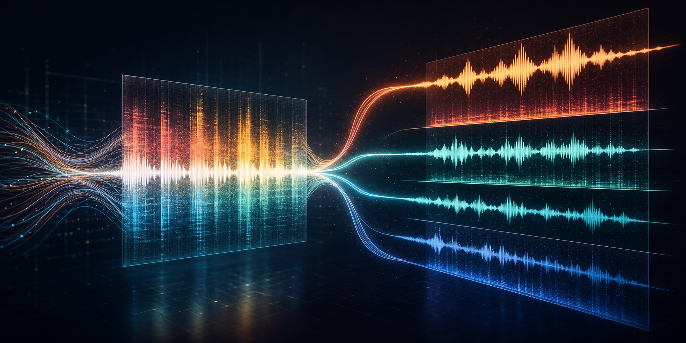
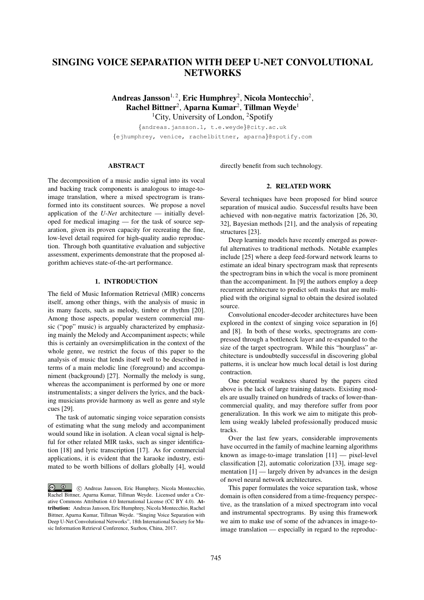
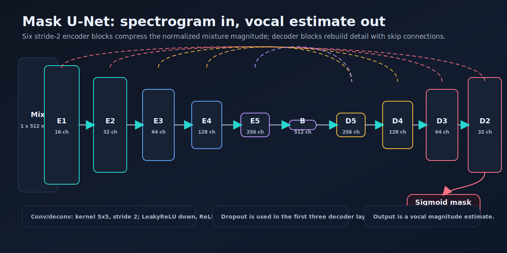
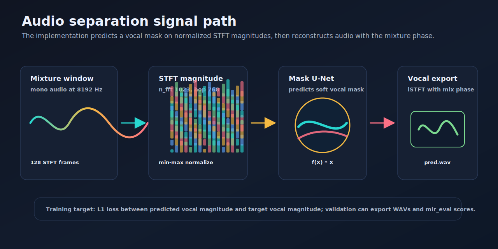
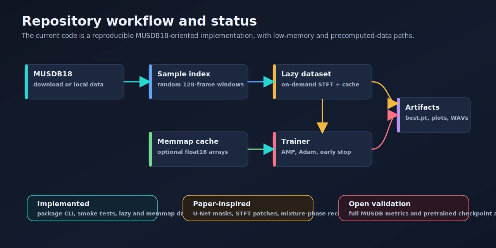

# Vocal Source Separation

<p align="center">
  <a href="https://github.com/alhussein-jamil/Soruce-Separation/actions/workflows/ci.yml"></a>
  <a href="https://www.python.org/downloads/"></a>
  <a href="https://pytorch.org/"></a>
  <a href="https://archives.ismir.net/ismir2017/paper/000171.pdf"></a>
  <a href="https://zenodo.org/records/1117372"></a>
</p>

<p align="center">
  
</p>

PyTorch implementation inspired by **Singing Voice Separation with Deep U-Net Convolutional Networks** by Andreas Jansson, Eric Humphrey, Nicola Montecchio, Rachel Bittner, Aparna Kumar, and Tillman Weyde. The project trains a U-Net to isolate vocals from music mixtures by predicting a soft mask over normalized STFT magnitude spectrograms, then reconstructing waveform audio with the mixture phase.

The original paper is available from the ISMIR archive: [archives.ismir.net/ismir2017/paper/000171.pdf](https://archives.ismir.net/ismir2017/paper/000171.pdf). A local copy is checked in as [article.pdf](article.pdf).

<p align="center">
  <a href="https://archives.ismir.net/ismir2017/paper/000171.pdf">
    
  </a>
</p>

## Project Status

| Area | Status |
|------|--------|
| Implementation | Package CLI, `MaskUNet`, lazy MUSDB18 dataset, optional memmap spectrogram cache, synthetic smoke tests, Ruff/pre-commit config, and GitHub Actions CI are in place. |
| Paper alignment | The core recipe follows the paper: U-Net mask prediction, stride-2 5x5 conv/deconv blocks, dropout in early decoder layers, 8192 Hz audio, 128-frame STFT patches, L1 magnitude loss, and mixture-phase reconstruction. |
| Differences | This repo currently trains the vocal separator on MUSDB18, while the paper also trained an instrumental separator and used a large private matched original/instrumental dataset. |
| Artifacts | No pretrained checkpoint or full MUSDB18 benchmark result is committed yet; runs write checkpoints, loss plots, and WAV examples under `artifacts/runs/`. |

## What This Implements

- Spectrogram U-Net that maps a mixed magnitude spectrogram to a vocal magnitude estimate.
- Six downsampling encoder layers and six transposed-convolution decoder layers with skip connections.
- Memmap-first training with optional on-demand STFT (`lazy` mode for CPU/smoke runs).
- Float16 memmap cache builder for fast repeated GPU training.
- MUSDB18 download/extract helper through the `musdb` package.
- Mixed precision on CUDA, `pin_memory`, multi-worker loaders, `zero_grad(set_to_none=True)`, optional `torch.compile`, Adam with AMSGrad, ReduceLROnPlateau, early stopping, and checkpointing.
- Validation export of mix, target vocal, and predicted vocal WAVs, plus approximate SDR scoring.

## Model Figures

The architecture figure mirrors the implementation in [src/vocal_sep/models/unet.py](src/vocal_sep/models/unet.py).



The signal path shows how audio becomes normalized magnitude patches, how the mask is applied, and how evaluation reconstructs WAV files.



Training follows a config-driven MUSDB18 workflow with either lazy STFT computation or a precomputed memmap cache.



Regenerate the deterministic SVG README figures and paper snapshot with:

```bash
python3 scripts/generate_readme_assets.py
pdftoppm -png -f 1 -l 1 -singlefile -r 125 article.pdf docs/assets/paper-snapshot
```

The opening banner was generated as a diffusion-style visual asset for this README and saved at `docs/assets/diffusion-source-separation-hero.png`.

## Repository Layout

```text
.
|-- article.pdf
|-- configs
|   |-- default.yaml
|   `-- smoke.yaml
|-- docs/assets
|-- scripts/generate_readme_assets.py
|-- src/vocal_sep
|   |-- audio
|   |-- data
|   |-- evaluation
|   |-- models
|   |-- training
|   `-- cli.py
|-- tests
`-- artifacts/runs        generated during training
```

## Installation

Use Python 3.10+ and install the package in editable mode:

```bash
python3 -m venv .venv
source .venv/bin/activate
pip install --upgrade pip
pip install -e ".[dev]"
pre-commit install
```

Check CUDA availability:

```bash
python3 - <<'PY'
import torch
print(torch.cuda.is_available())
PY
```

## Running

The fastest local confidence check is the synthetic training smoke test, which does not download MUSDB18:

```bash
pytest tests/test_training_smoke.py -v
```

Run the full test suite:

```bash
pytest
```

Run Ruff and the configured pre-commit hooks:

```bash
ruff check .
pre-commit run --all-files
```

Train a tiny CPU smoke configuration (synthetic unit test uses no MUSDB):

```bash
vocal-sep train --config configs/smoke.yaml
```

Train on MUSDB18 with the default memmap pipeline (builds cache automatically if missing):

```bash
vocal-sep train --config configs/default.yaml
```

Build or refresh the memmap cache explicitly:

```bash
vocal-sep cache --config configs/default.yaml
```

Evaluate the latest compatible checkpoint:

```bash
vocal-sep train --config configs/default.yaml --eval
```

## Configuration

Most experiment settings live in [configs/default.yaml](configs/default.yaml):

| Key | Purpose |
|-----|---------|
| `num_samples` | Target number of random training windows. |
| `num_tracks` | Optional cap on MUSDB tracks for small experiments. |
| `dataset_mode` | `memmap` (default) reads a precomputed cache; `lazy` computes STFTs on demand. |
| `batch_size`, `epochs`, `patience`, `min_delta` | Training scale and early stopping. |
| `lr_scheduler`, `lr_patience`, `lr_factor`, `min_lr` | ReduceLROnPlateau settings (`none` disables). |
| `loss_scale`, `learning_rate`, `amsgrad` | Optimization settings. |
| `sample_rate`, `n_fft`, `hop_length`, `win_length`, `n_frames` | Audio/STFT patch settings. |
| `num_workers`, `pin_memory`, `prefetch_factor` | DataLoader throughput controls. |
| `compile_model` | Enables `torch.compile` when available. |
| `log_level` | `DEBUG`, `INFO`, `WARNING`, or `ERROR` for Rich-colored logging. |

## Logging

Training and caching use [Rich](https://github.com/Textualize/rich) for colored logs, config tables, download progress, and batch progress bars:

```bash
vocal-sep train --config configs/smoke.yaml          # INFO (default)
vocal-sep train --config configs/smoke.yaml -v       # DEBUG
vocal-sep train --config configs/smoke.yaml -q       # WARNING+
vocal-sep train --config configs/smoke.yaml --log-level DEBUG
```

## Data And Outputs

The loader expects MUSDB18 and can download `data/musdb18.zip` from Zenodo when the dataset is missing:

```text
data/train/
data/test/
```

Generated run artifacts are written under timestamped directories:

```text
artifacts/cache/             optional memmap arrays
artifacts/runs/<timestamp>/
  checkpoints/best.pt
  audio/
  plots/
```

## Notes

The local paper snapshot comes from the ISMIR 2017 paper, which is distributed under CC BY 4.0 with attribution on the first page.
